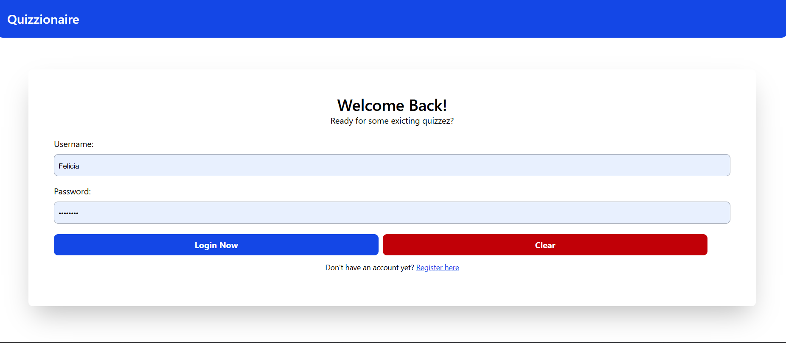
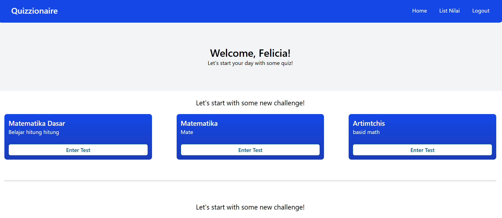
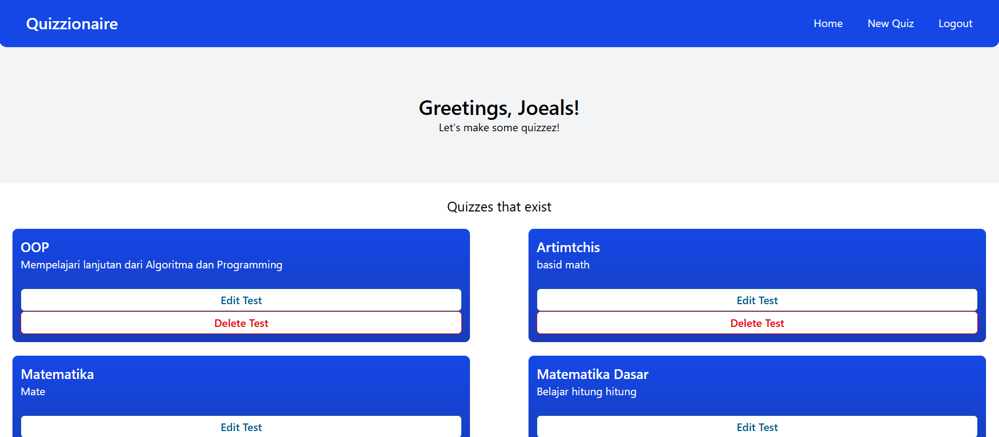
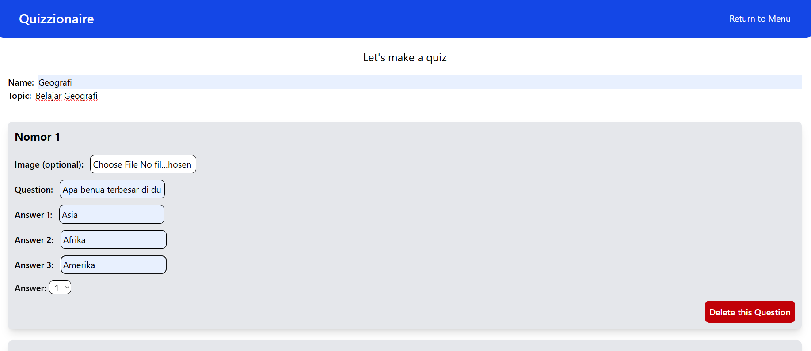

# [Quiz-zionaire] - Website Project

## Overview
This website is made for the final project for Website Programming. Heavily inspired on ThatQuiz.com that me and my teammate Abdussalam work on, we use it as the fundamentals for learning how data from server (SQL) can be manipulate, making a dynamic website using JQuery.

## Role
- The JQuery code (Add, delete question, pop-ups and side-menu)
- Database connection and manipulation (Login, register, log-out and adding quiz)
- The UI design for the website
- A little tweak on the database (Mostly done by Abdussalam)

## Purpose
- Learning to manipulate data from server using PHP
- Build an interactive, dynamic website using JQuery & PHP
- Learning teamwork through coding

## Tools
- PHP
- CSS Tailwind
- JQuery
- XAMPP (SQL)

## Screenshot
### Login

### Student's menu

### Teacher's menu

### Add question & quiz

To set up:  
1. Create a new database in phpMyAdmin.  
2. Import the `webquiz.sql` file.  
3. Update `connect.php` in PHP/DB folder with your credentials.  

## Live Demo
*(Currently unavailable for hosting — see documentation and source code in this repository)* 

